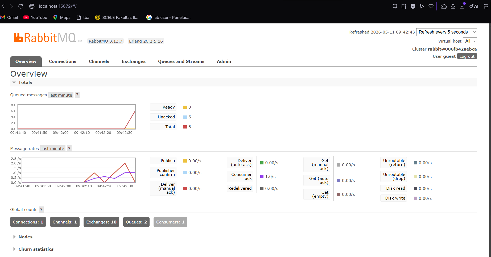
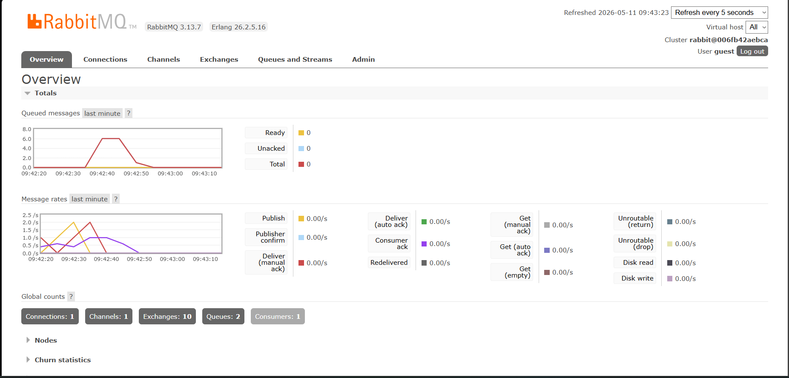
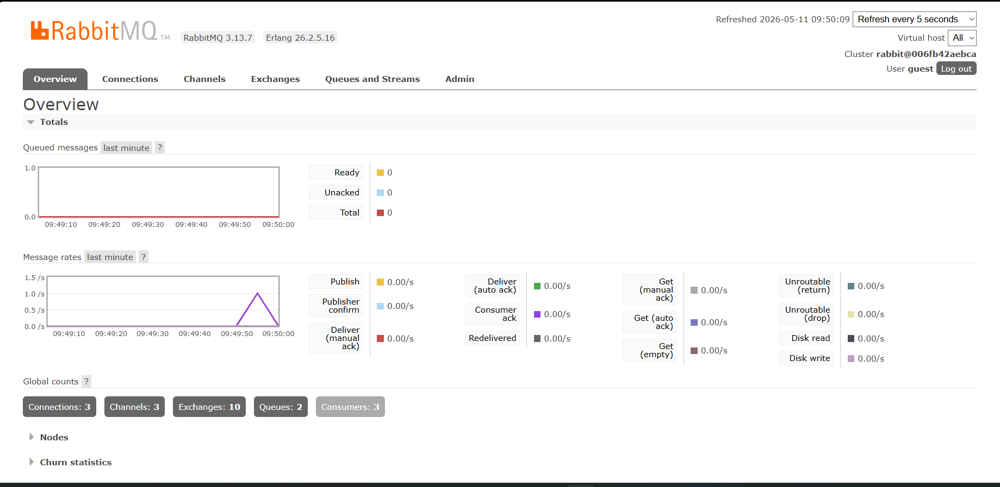
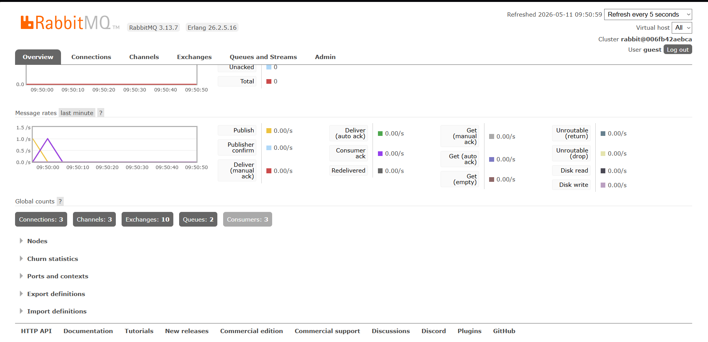
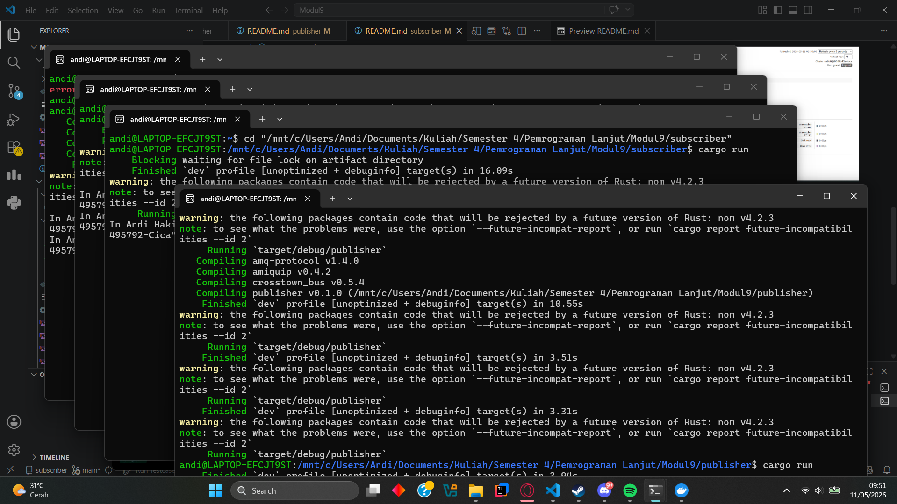

**a. What is amqp?**
AMQP (Advanced Message Queuing Protocol) adalah standar protokol terbuka di layer aplikasi untuk *message-oriented middleware*. Protokol ini memungkinkan pengiriman pesan yang aman, andal, dan asinkron antar sistem.

**b. What does it mean? guest:guest@localhost:5672**
- `guest` pertama adalah username default dari RabbitMQ.
- `guest` kedua adalah password default dari RabbitMQ.
- `localhost:5672` adalah host dan port default tempat *message broker* (RabbitMQ) menerima koneksi.

## Simulation slow subscriber

**Kenapa total antrean bisa menumpuk?**
Lonjakan antrean terjadi karena publisher menghasilkan dan menembakkan pesan secara instan, sedangkan program subscriber kita perlambat eksekusinya, memakan waktu 1 detik penuh per proses. Pesan-pesan yang belum sempat dikonsumsi ini mengendap mengantre di dalam broker.

**Refleksi Menjalankan 3 Subscriber**
Saat menjalankan 3 subscriber sekaligus, *spike* antrean pada RabbitMQ menurun jauh lebih cepat. Pesan tidak lagi membebani satu proses, namun didistribusikan menggunakan metode *round-robin* ke ketiga *worker* subscriber yang tersedia secara paralel. Simulasi ini membuktikan tingginya tingkat adaptasi (*scalability*) dan performa *load-balancing* pada *event-driven architecture*.

